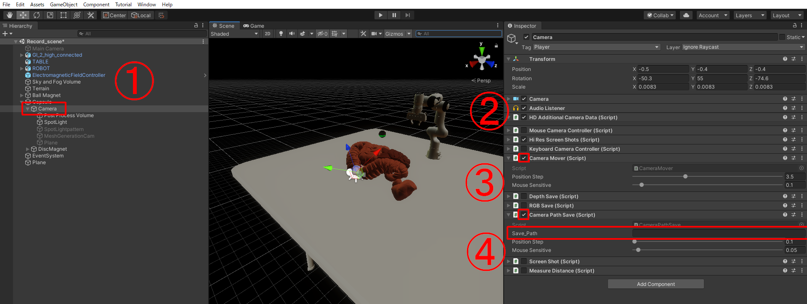

[English](README.md) | [日本語](README.jp.md)  

Simulation Dataset of Endoscopic RGB/Depth Images
=====
<table border=0>
  <tr>
    <td style="text-align: center;">
      
      
      <p align="center">RGB</p>
    </td>
    <td style="text-align: center;">
      
      
      <p align="center">Depth</p>
    </td>
    <td style="text-align: center;">
      
      
      <p align="center">Camera Path (green line)</p>
    </td>
  </tr>
</table>

# Overview
This repository provides an interface for generating simulation image data of the gastrointestinal tract based on the simulation environment [VR-Caps](https://github.com/CapsuleEndoscope/VirtualCapsuleEndoscopy) for capsule endoscopy. It implements a method to add the following two steps to VR-Caps for generating images. The dataset used in the paper [View Synthesis of Endoscope Images by Monocular Depth Prediction and Gaussian Splatting](https://ieeexplore.ieee.org/abstract/document/10782148), presented at EMBC2024, can be downloaded [here](#download).

- Creating custom camera path using Unity GUI  
- Generating RGB and Depth Images along camera path  

# Setup

## Dependencies
- Unity version: 2019.3.3f1  
- Unity Hub  
- Anaconda  
- Python 3.10  

## Clone the repository
```sh
  
```  

## Launch the Unity Project  
Run VR-Caps-Unity / Assets / Scenes / Record_scene.unity. 


# Generating Camera Path  

## Recording Camera Path Using GUI
1. Select Hierarchy Window > Capsule > Camera.  
2. Check the box for Inspector Window > Camera Mover.  
3. Check the box for Inspector Window > Camera Path Save.  
4. Specify the file path for the CSV in Inspector Window > Camera Path Save > Save Path.  

   
5. Click the play button (triangle icon) to enable camera movement using the mouse and keyboard:  

   W : Move forward  
   S : Move backward  
   A : Move left  
   D : Move right   
   Q : Move up  
   E : Move down    
   Mouse Drag : Rotate the camera freely  

6. Press the **space key** to start recording the camera path.  
7. Press the **space key** again to stop recording the camera path.  
   -> The csv file will be generated at the specified save location.  


# Generating Image Data

## How to Specify the Created Camera Path  
### Generating from a Single Camera Path  
1. Select Hierarchy Window > Capsule > Camera.  
2. Specify the path of the CSV file in Inspector Window > Depth Save > Load Camera Pose Path.  
3. Specify the path of the CSV file in Inspector Window > RGB Save > Load Camera Pose Path.  

     

### Generating from Multiple Camera Paths  
1. Place multiple CSV files in VR-Caps-Unity / Assets / Resources.  
2. Select Hierarchy Window > Capsule > Camera.  
3. Set Inspector Window > Depth Save > Load Camera Pose Path to **empty** (leave it blank).  
4. Set Inspector Window > RGB Save > Load Camera Pose Path to **empty** (leave it blank).  

---

## Generating RGB Images  
1. Select Hierarchy Window > Capsule > Camera.  
2. Enable the checkbox for Inspector Window > RGB Save.  
3. Specify the save folder path in Inspector Window > RGB Save > Save Folder Path.  
     

4. Press the Play button to automatically start capturing images along the camera path.  
   -> RGB images (.png) will be generated in the specified folder.  

---

## Generating Depth Images  
1. Go to Edit Tab > Project Settings > HDRP Default Settings > After Post Process and select DepthExample.  

     
     
2. Select Hierarchy Window > Capsule > Camera.  
3. Enable the checkbox for Inspector Window > Depth Save.  
4. Specify the save folder path in Inspector Window > Depth Save > Save Folder Path.  

     
5. Press the Play button to automatically start capturing images along the camera path.  
   -> Depth image data (.exr) will be generated in the specified folder.

## How to Check Depth Data   

1. Install the following modules.  
- numpy  
- openEXR  
- matplotlib  
```sh
conda install numpy
conda install -c conda-forge openexr-python
pip install matplotlib
```  

2. Copy the path of the exr file.    

3. Specify the copied path in the filename variable within VR-Caps-Unity/Assets/test_exr.py.  

4. Run test_exr.py in the command prompt.  
-> The depth shape like the one below will be displayed.  


# Download
The data generated can be downloaded from the link below.  
https://data.airc.aist.go.jp/cvrt/endoscopic_simulation_dataset.zip

# Reference
```
@inproceedings{masuda2024view,
  title={View Synthesis of Endoscope Images by Monocular Depth Prediction and Gaussian Splatting},
  author={Masuda, Takeshi and Sagawa, Ryusuke and Furukawa, Ryo and Kawasaki, Hiroshi},
  booktitle={2024 46th Annual International Conference of the IEEE Engineering in Medicine and Biology Society (EMBC)},
  pages={1--6},
  year={2024},
  organization={IEEE}
}
```


