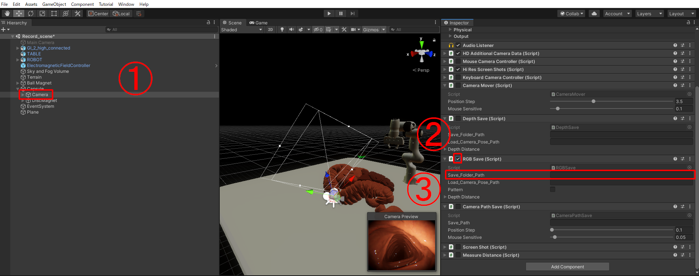

Adding Functionality to Generate RGB Images and Depth Data
=====


## Overview
&nbsp;&nbsp;This repository provides an interface for generating simulation image data of the gastrointestinal tract based on VR-Caps.
Image generation consists of the following two steps:

- Creating arbitrary camera paths using Unity's GUI  
- Generating RGB or Depth images along the camera path

## Development Environment
・Unity version: 2019.3.3f1  
・Unity Hub  
・Anaconda  
・Python 3.10  

## Getting Started

### 1. Installation
#### Clone the repository
```sh

```  

### 2. Launch the project  
Launch VR-Caps-Unity > Assets > Scenes > Record_scene.unity

## Data Creation Method  
### Generating RGB Images  
1. Select Hierarchy Window > Capsule > Camera  
2. Enable the checkbox for RGBSave.cs  
3. Enter the absolute path of the save destination in RGBSave.cs > Save Folder Path  
   
4. Press the play button (play icon) to automatically start shooting along the camera path  
   -> Generate RGB images (.png) at the save destination
   
### Generating Depth Images  
1. Select Edit Tab > Project Setting > HDRP Default Settings > After Post Process > DepthExample
   
   
3. Select Hierarchy Window > Capsule > Camera  
4. Enable the checkbox for DepthSave.cs  
5. Enter the absolute path of the save destination in DepthSave.cs > Save Folder Path  
    
6. Press the play button to automatically start shooting along the camera path  
   -> Generate depth image data (.exr) at the save destination  

## Download
The data we generated can be downloaded from the following
```sh

```  

## Others
### How to Check Depth Data  

1. Install the following modules  
- numpy  
- openEXR  
- matplotlib  
```sh
conda install numpy
conda install -c conda-forge openexr-python
pip install matplotlib
```  

2. Right-click on the exr image file to be checked and select Copy Path  

3. Specify the copied path in the filename variable in VR-Caps-Unity/Assets/test_exr.py  

4. Run test_exr.py in the command prompt, etc.  


### How to Create Camera Paths  
1. Select Hierarchy Window > Capsule > Camera  

2. Enable the checkboxes for CameraPathSave.cs and CameraMover.cs  

3. Disable the checkboxes for RGBSave.cs and DepthSave.cs  

4. Enter the absolute path of the save destination in CameraPathSave.cs > Save Path  

5. Press the play button to enable camera movement using mouse and key operations  

   - W: Forward, S: Backward, A: Left, D: Right  
   - Q: Up, E: Down  
   - Mouse drag: Arbitrary rotation

6. Press the space key to start recording the camera path
7. Press the space key again to stop recording the camera path  
   -> Generate a csv file at the save destination
   
### How to Specify the Created Camera Path  
1. Select Hierarchy Window > Capsule > Camera  

2. Specify the path of the csv file in RGBSave.cs > Load Camera Pose Path  

&nbsp;&nbsp;&nbsp;&nbsp;(The same applies to generating depth images)

## Reference

```
@misc{incetan2020vrcaps,
      title={VR-Caps: A Virtual Environment for Capsule Endoscopy}, 
      author={Kagan Incetan and Ibrahim Omer Celik and Abdulhamid Obeid and Guliz Irem Gokceler and Kutsev Bengisu Ozyoruk and Yasin Almalioglu and Richard J. Chen and Faisal Mahmood and Hunter Gilbert and Nicholas J. Durr and Mehmet Turan},
      year={2020},
      eprint={2008.12949},
      archivePrefix={arXiv},
      primaryClass={cs.CV}
}
```


