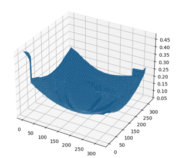

Adding Function to Generate RGB Images and Depth Data
=====


# Overview
This repository provides an interface for generating simulation image data of the gastrointestinal tract based on the simulation environment [VR-Caps](https://github.com/CapsuleEndoscope/VirtualCapsuleEndoscopy) for capsule endoscopy. It implements a method to add the following two steps to VR-Caps for generating images. The dataset used in the paper ["View Synthesis of Endoscope Images by Monocular Depth Prediction and Gaussian Splatting"](https://ieeexplore.ieee.org/abstract/document/10782148), presented at EMBC2024, can be downloaded [here](#download).

- Creating Custom Camera Path Using Unity GUI  
- Generating RGB or Depth Images along camera path  

# Setup

## Dependencies
- Unity version: 2019.3.3f1  
- Unity Hub  
- Anaconda  
- Python 3.10  

## Clone the repository
```sh
  
```  

## Launch the Unity Project  
Launch **VR-Caps-Unity / Assets / Scenes / Record_scene.unity**. 


# Generating Camera Path  

## Recording Camera Path Using GUI
1. Select **Hierarchy Window > Capsule > Camera**.  
2. In the **Inspector Window**, check the box for **CameraMover**.  
3. In the **Inspector Window**, check the box for **CameraPathSave**.  
4. In the **Inspector Window > Camera Path Save**, specify the file path for the CSV in **Save Path**.  

   
5. Click the Play button to enable camera movement using the mouse and keyboard:  

   W : Move forward  
   S : Move backward  
   A : Move left  
   D : Move right   
   Q : Move up  
   E : Move down    
   Mouse Drag : Rotate the camera freely  

6. Press the **Spacebar** to start recording the camera path.  
7. Press the **Spacebar** again to stop recording the camera path.  
   -> The CSV file is generated at the specified save location.  


# Generating Image Data

## How to Specify the Created Camera Path  
### Generating from a Single Camera Path  
1. Select **Hierarchy Window > Capsule > Camera**.  
2. In the **Inspector Window > Depth Save**, specify the path of the CSV file in **Load Camera Pose Path**.  
3. In the **Inspector Window > RGB Save**, specify the path of the CSV file in **Load Camera Pose Path**.  
     

### Generating from Multiple Camera Paths  
1. Place multiple camera path CSV files in **VR-Caps-Unity / Assets / Resources**.  
2. Select **Hierarchy Window > Capsule > Camera**.  
3. In the **Inspector Window > Depth Save**, set **Load Camera Pose Path** to empty (leave it blank).  
4. In the **Inspector Window > RGB Save**, set **Load Camera Pose Path** to empty (leave it blank).  

---

## Generating RGB Images  
1. Select **Hierarchy Window > Capsule > Camera**.  
2. Enable the checkbox for **RGB Save** in the **Inspector Window**.  
3. In the **Inspector Window > RGB Save**, specify the save folder path in **Save Folder Path**.  
     
4. Press the Play button (triangle icon) to automatically start capturing images along the camera path.  
   -> RGB images (.png) will be generated in the specified folder.  

---

## Generating Depth Images  
1. Go to **Edit Tab > Project Settings > HDRP Default Settings > After Post Process** and select **DepthExample**.  
     
     
2. Select **Hierarchy Window > Capsule > Camera**.  
3. Enable the checkbox for **Depth Save** in the **Inspector Window**.  
4. In the **Inspector Window > Depth Save**, specify the save folder path in **Save Folder Path**.  
     
5. Press the **Play button** to automatically start capturing images along the camera path.  
   -> Depth image data (.exr) will be generated in the specified folder.

## How to Check Depth Data   

1. Install the following modules.  
- numpy  
- openEXR  
- matplotlib  
```sh
conda install numpy
conda install -c conda-forge openexr-python
pip install matplotlib
```  

2. Copy the path of the exr file.    

3. Specify the copied path in the filename variable within **VR-Caps-Unity/Assets/test_exr.py**.  

4. Run test_exr.py in the command prompt.  
-> The depth shape like the one below will be displayed.  


# Download
The data generated so far can be downloaded from the link below.
```sh

```  

# Reference
```
@inproceedings{masuda2024view,
  title={View Synthesis of Endoscope Images by Monocular Depth Prediction and Gaussian Splatting},
  author={Masuda, Takeshi and Sagawa, Ryusuke and Furukawa, Ryo and Kawasaki, Hiroshi},
  booktitle={2024 46th Annual International Conference of the IEEE Engineering in Medicine and Biology Society (EMBC)},
  pages={1--6},
  year={2024},
  organization={IEEE}
}
```


