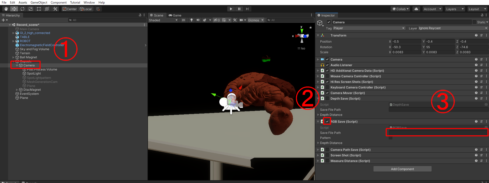
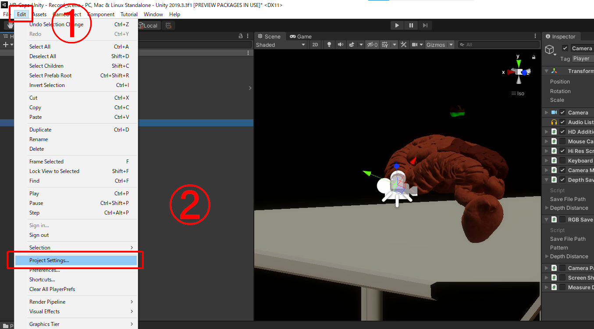
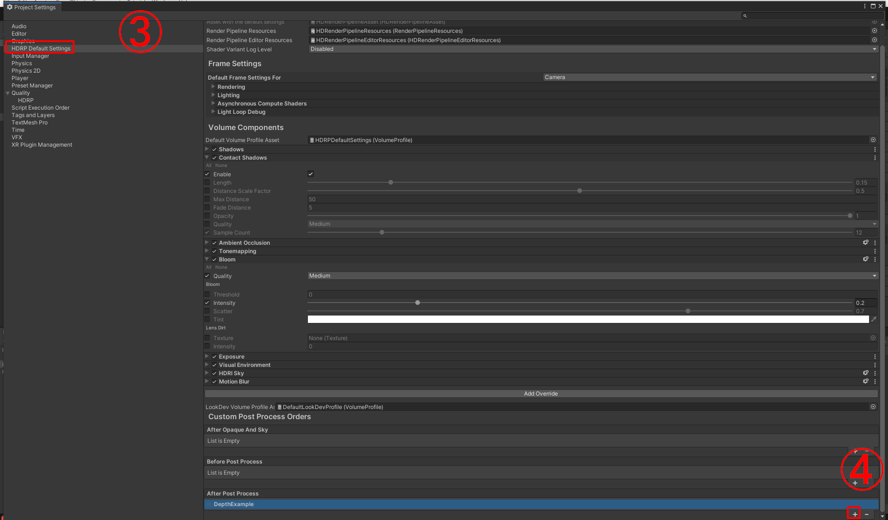
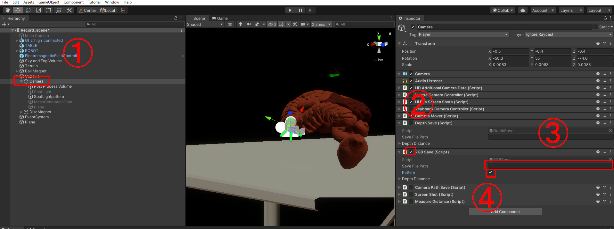

RGB画像と深度データを生成するための機能追加
=====


## 概要
・VR-Capsの3Dモデルからカメラパスに沿ってRGB画像またはDepthデータの自動取得が可能

・カメラパスの任意作成が可能  (デフォルトでは事前に作成したカメラパスを使用)  

## 開発環境
・Unity version: 2019.3.3f1  
・Unity Hub  
・Anaconda  
・Python 3.10  

## 始め方

### 1. インストール
#### レポジトリのクローン
```sh
https://github.com/TakuyaTorii0806/VR-Caps_for_image_generation.git  
```  

### 2. プロジェクトの起動  
VR-Caps-Unity > Assets > Scenes > Record_scene.unityを起動 

## データ作成方法  
### RGB画像の生成  
1. Hierarchy Window > Capsule > Cameraを選択  
2. RGBSave.csのチェックボックスを有効  
3. RGBSave.cs > Save File Path の空欄に保存先の絶対パスを記入  
   
4. 実行ボタン(再生マーク)を押すと自動でカメラパスに沿って撮影を開始  
   保存先のパスにRGB画像(.png)が生成される
   
### 深度画像の生成  
1. Edit Tab > Project Setting > HDRP Default Settings > After Post Process > DepthExampleを指定
   
   
3. Hierarchy Window > Capsule > Cameraを選択  
4. DepthSave.csのチェックボックスを有効  
5. DepthSave.cs > Save File Path の空欄に保存先の絶対パスを記入
     
6. 実行ボタンを押すと自動でカメラパスに沿って撮影を開始  
   保存先のパスに深度画像データ(.exr)が生成される  

### パターンの投影  
1. Hierarchy Window > Capsule > Cameraを選択  
2. RGBSave.csのチェックボックスを有効  
3. RGBSave.cs > Patternのチェックボックスの有効で光源を起動  
     


## その他

### パターン投影の詳細設定  

1. Hierarchy Window > Capsule > Camera > SpotLightを選択 
 
2. Inspector Window > Light > General > ModeでBakedを指定  

3. Inspector Window > Light > Shape > Coneを指定  

4. Radiusで光源のサイズ調整  

5. Inspector Window > Light > Emission > Colorで色指定  

6. Inspector Window > Light > Emission > CookieでAssetsの中のパターン画像を指定  


### 深度データの確認方法  

1. 下記モジュールをインストール  
・numpy  
・openEXR  
・matplotlib  
```sh
conda install numpy
conda install -c conda-forge openexr-python
pip install matplotlib
```  

2. 確認に使うexr画像ファイルの上でShift+右クリックしパスのコピーを選択  

3. コピーしたパスをVR-Caps-Unity/Assets/test_exr.py内のfilename変数に指定  

4. コマンドプロンプト等でtest_exr.pyを実行

### カメラパスの作成方法  
1. Hierarchy Window > Capsule > Cameraを選択  

2. CameraPathSave.csとCameraMover.csのチェックボックスを有効  

3. RGBSave.csとDepthSave.csのチェックボックスを無効  

4. CameraPathSave.cs > Save File Path の空欄に保存先の絶対パスを記入  

5. 実行ボタンを押下すると、マウスとキー操作によるカメラ移動が可能  

   ・W : 前方向, S : 後方向, A : 左方向, D : 右方向  
   ・Q : 上昇, E : 下降  
   ・マウスのドラッグ : 任意回転  

6. 移動終了後、スペースキー押下でカメラパスを生成  


